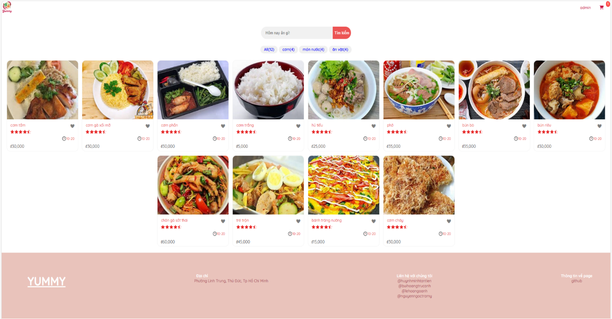
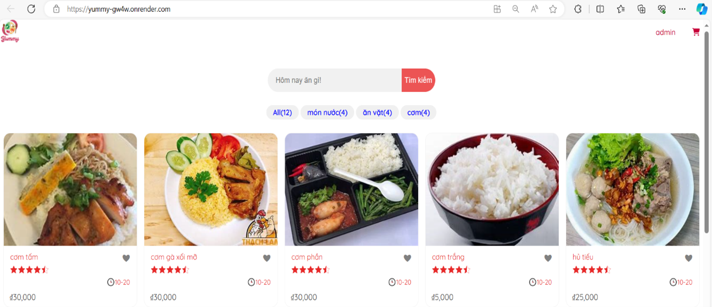
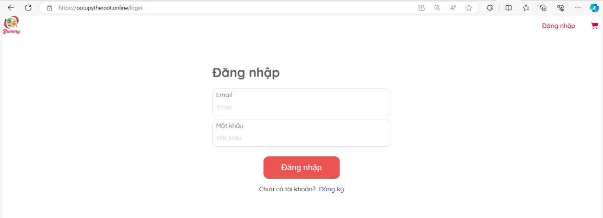
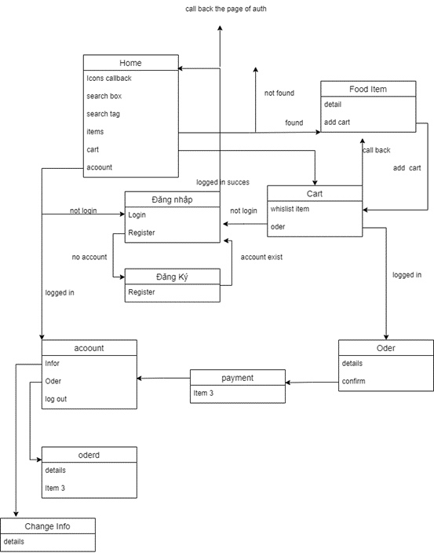
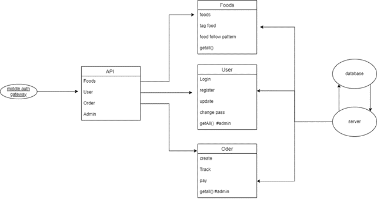

# Xây Dựng Trang Web Bán Hàng

## Giới Thiệu
Đồ án này nhằm xây dựng một trang web bán hàng trực tuyến cho phép người dùng đặt đồ ăn một cách thuận tiện và dễ dàng. Trang web cung cấp một giao diện sáng sủa và thân thiện giúp người dùng dễ dàng tìm kiếm và chọn lựa các món ăn yêu thích.

## Tính Năng Chính
1. **Quản lý đơn đặt hàng**:
   - Người dùng có thể xem lại đơn hàng, chỉnh sửa số lượng hoặc xóa món ăn trong giỏ hàng trước khi xác nhận đặt hàng.
   - Sau khi xác nhận đơn hàng, người dùng sẽ nhận được thông báo xác nhận và thông tin về thời gian dự kiến giao hàng.

2. **Đăng ký tài khoản và đăng nhập**:
   - Người dùng có thể đăng ký tài khoản và đăng nhập để lưu trữ thông tin cá nhân và địa chỉ giao hàng cho các lần đặt hàng sau.

3. **Tính năng quản trị**:
   - Quản lý món ăn trên menu: Thêm, xóa, sửa món ăn.
   - Theo dõi toàn bộ đơn hàng của khách hàng.

## Công Nghệ Sử Dụng
- **Frontend**: ReactJS
- **Backend**: ExpressJS
- **Database**: MongoDB

## Tổng Quan Hệ Thống
### Giao Diện Web

### Flow Front End

### Backend Graph Model

### Model Data
- **Food**: Lưu trữ thông tin các món ăn.
- **Order**: Lưu trữ thông tin các đơn đặt hàng.
- **User**: Lưu trữ thông tin người dùng.

## Kết Quả
- Xây dựng giao diện web và backend.
- Liên kết với database để lưu trữ thông tin đăng ký, đơn hàng, và món ăn.
- Xây dựng API quản lý các resource của trang web.
- Tạo các tính năng cho phép người dùng đăng ký, đăng nhập, đặt hàng, thanh toán, và xem lại đơn hàng.

## Triển Khai
Trang web được triển khai tại: [https://occupytheroot.online](https://occupytheroot.online)

